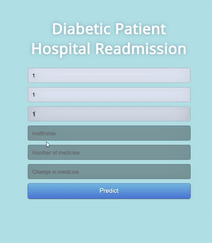
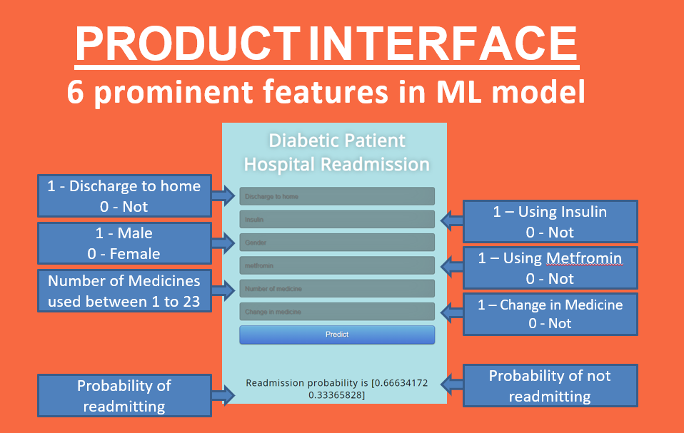
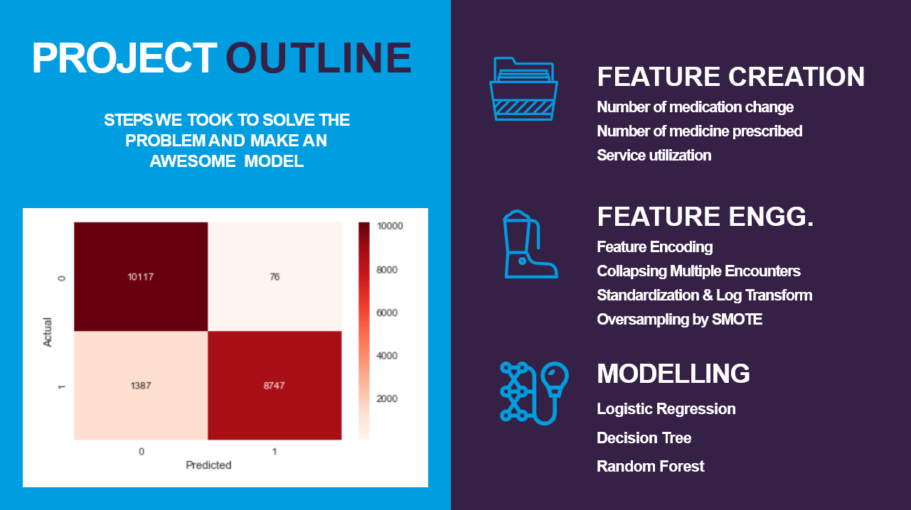
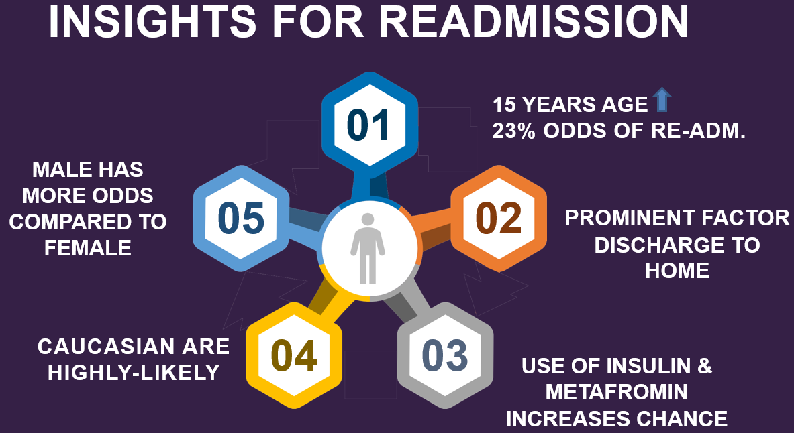
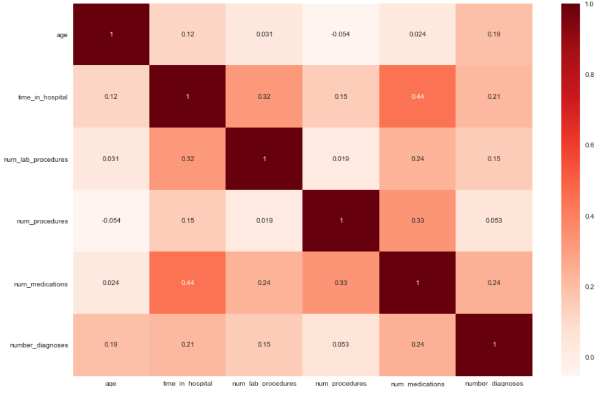

# Identifying-Diabetic-Patient-Readmission
Classifying the hospital re-admission probability of a DIABETIC patient by using appropriate Data Science techniques.
You can view the project demo on [YouTube](https://www.youtube.com/watch?v=qamLBQQZP14).
   
## Table of contents
* [General info](#general-info)
* [Screenshots](#screenshots)
* [Demo](#demo)
* [Technologies and Tools](#technologies-and-tools)
* [Setup](#setup)
* [Process](#process)
* [Code Examples](#code-examples)
* [Features](#features)
* [Status](#status)
* [Contact](#contact)

## General info

The theme at HACK UNT 19 was to use technology to improve accessibility by finding a creative solution to benefit the lives of those with a disability. 
We wanted to make it easy for 70 million deaf people across the world to be independent of translators for there daily communication needs, so we designed the app to work as a personal translator 24*7 for the deaf people.

## Demo



**The entire demo of the project can be found on [YouTube](https://www.youtube.com/watch?v=qamLBQQZP14).**

## Screenshots






## Technologies and Tools
* Python 
* Flask
* Scikit-learn
* HTML

## Setup

* Use comand promt to setup environment by using install_packages.txt and install_packages_gpu.txt files. 
 
`pyton -m pip r install_packages.txt`

This will help you in installing all the libraries required for the project.

## Process

* Run `set_hand_histogram.py` to set the hand histogram for creating gestures. 
* Once you get a good histogram, save it in the code folder, or you can use the histogram created by us that can be found [here](https://github.com/ashish1993utd/Sign-Language-Interpreter-using-Deep-Learning/blob/master/code/hist).
* Added gestures and label them using OpenCV which uses webcam feed. by running `create_gestures.py` and stores them in a database. Alternately, you can use the gestures created by us [here](https://github.com/ashish1993utd/Sign-Language-Interpreter-using-Deep-Learning/blob/master/code/gesture_db.db).
* Add different variations to the captured gestures by flipping all the images by using `Rotate_images.py`.
* Run `load_images.py` to split all the captured gestures into training, validation and test set. 
* To view all the gestures, run `display_gestures.py` .
* Train the model using Keras by running `cnn_model_train.py`.
* Run `final.py`. This will open up the gesture recognition window which will use your webcam to interpret the trained American Sign Language gestures.  

## Code Examples

````
import pickle

pickle.dump(scaler, open('tranform.pkl','wb'))
pickle.dump(rf_clf, open('model.pkl','wb'))

X_test=scaler.transform(X_test_unscaled[:1])

predictions=rf_clf.predict(X_test)
print("Predicted Result : ",predictions)

predictions = rf_clf.predict_proba(X_test)
print("Predicted Result probability : ",predictions)

````
````
import numpy as np
from flask import Flask, request, jsonify, render_template
import pickle

app = Flask(__name__)
scaler = pickle.load(open('tranform.pkl','rb'))
model = pickle.load(open('model.pkl', 'rb'))

@app.route('/')
def home():
    return render_template('interface.html')

@app.route('/predict',methods=['POST'])
def predict():
    '''
    For rendering results on HTML GUI
    '''
    int_features = [int(x) for x in request.form.values()]
    
    final_features = [np.array(int_features)]
    
    final_features = np.pad(final_features, (0, 63), 'constant')
    
    final_features = scaler.transform(final_features)
    
    prediction = model.predict_proba(final_features)

    output = prediction[0]

    return render_template('interface.html', prediction_text='Readmission probability is {}'.format(output))

if __name__ == "__main__":
    app.run(debug=True)

````


## Status
Project is: _finished_.

## Contact
If you loved what you read here and feel like we can collaborate to produce some exciting stuff, or if you
just want to shoot a question, please feel free to connect with me on 
<a href="mailto:manishshukla.ms18@gmail.com">email</a> or 
<a href="https://www.linkedin.com/in/manishshukla-ms/" target="_blank">LinkedIn</a>

